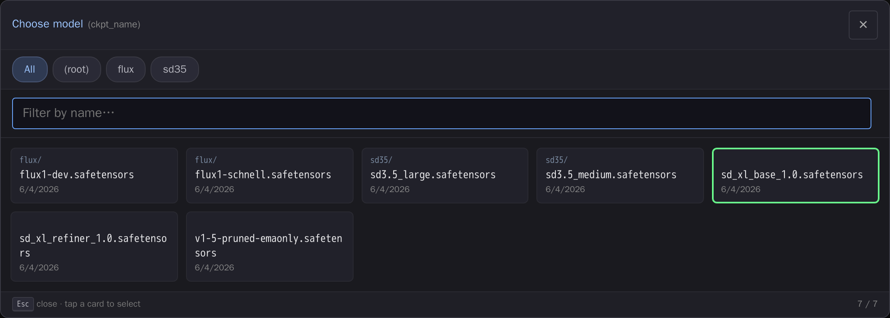

# comfyui-model-gallery

Touch-first card-grid picker with preview thumbnails for the folder-backed model combos (LoRA, checkpoint, VAE, ControlNet, UNet, CLIP, upscale).

> Part of a family of mobile-first ComfyUI usability packs
> ([gallery-loader](https://github.com/laurigates/comfyui-gallery-loader),
> [sampler-info](https://github.com/laurigates/comfyui-sampler-info)):
> touch-friendly HTML modals that replace clunky native LiteGraph controls,
> detected by widget name, additive and non-clobbering.



*The card-grid picker over a `ckpt_name` combo: subfolder filter chips,
fuzzy name filter, and the current value highlighted. (Screenshot uses
placeholder model names.)*

## Install

```sh
cd <ComfyUI>/custom_nodes
git clone https://github.com/laurigates/comfyui-model-gallery
```

Restart ComfyUI; hard-refresh the browser tab (Ctrl+Shift+R / Cmd+Shift+R).

## What it does

TODO — describe the widgets it enhances and the modal it opens.

## Compatibility

- ComfyUI: modern Vue frontend (`comfyui-frontend-package >= 1.40`) for the
  `widget.onPointerDown` interception hook.
- Frontend changes (JS/CSS) take effect on browser hard-refresh — no restart.

## License

MIT — see `LICENSE`.
