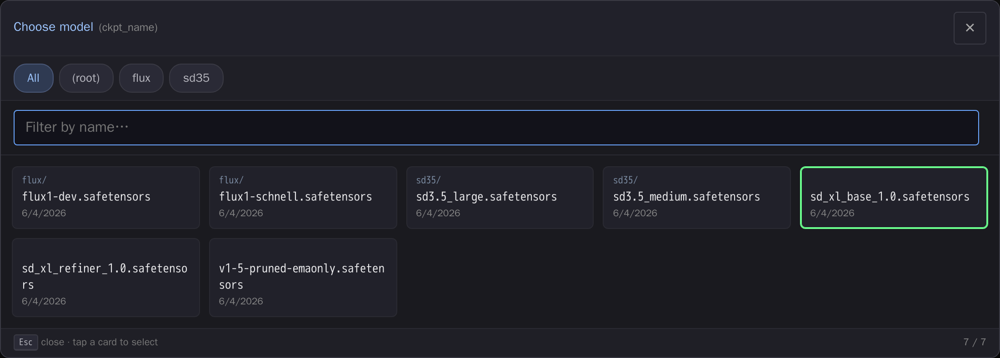

# comfyui-model-gallery

Touch-first card-grid picker with preview thumbnails for the folder-backed model combos (LoRA, checkpoint, VAE, ControlNet, UNet, CLIP, upscale).

> Part of a family of mobile-first ComfyUI usability packs built on the shared
> [`@laurigates/comfy-modal-kit`](https://github.com/laurigates/comfy-modal-kit)
> — [gallery-loader](https://github.com/laurigates/comfyui-gallery-loader),
> [prompt-editor](https://github.com/laurigates/comfyui-prompt-editor),
> [sampler-info](https://github.com/laurigates/comfyui-sampler-info),
> [touch-numeric](https://github.com/laurigates/comfyui-touch-numeric),
> [touch-connect](https://github.com/laurigates/comfyui-touch-connect),
> [touch-resize](https://github.com/laurigates/comfyui-touch-resize),
> [touch-tooltips](https://github.com/laurigates/comfyui-touch-tooltips):
> touch-friendly HTML modals that replace clunky native LiteGraph controls,
> detected by widget name, additive and non-clobbering.
>
> Via the kit's cross-pack field-provider registry (v0.4.0) this pack also
> registers the gallery as an **inline** control, so an editor built on the kit
> (e.g. prompt-editor) can mount the model picker directly in a field row — not
> only on canvas tap. See [ADR-0002](docs/blueprint/adrs/0002-adopt-field-provider-and-click-coordinator.md).



*The card-grid picker over a `ckpt_name` combo: subfolder filter chips,
fuzzy name filter, and the current value highlighted. (Screenshot uses
placeholder model names.)*

## Install

```sh
cd <ComfyUI>/custom_nodes
git clone https://github.com/laurigates/comfyui-model-gallery
```

Restart ComfyUI; hard-refresh the browser tab (Ctrl+Shift+R / Cmd+Shift+R).

## What it does

Detects folder-backed model combos **by widget name** (`ckpt_name`,
`lora_name`, `vae_name`, `control_net_name`, `unet_name`, `clip_name*`,
`upscale_model`, …) and replaces the native LiteGraph dropdown with a
touch-first card grid: subfolder filter chips, fuzzy name filter, mtime, and
the current value highlighted. The exact combo string is written back verbatim
so serialized workflows never churn.

### Model info

Each card is annotated with *what the model is*, in two layers:

1. **Filename corpus** (instant, offline, every file type) — base-architecture
   family + notable-model badges and a one-line summary, matched by pattern
   against the filename (`web/data/models.json`). Works for `.ckpt`/`.pth`/GGUF
   and files with no embedded metadata. The same info also feeds the fuzzy
   filter (search `sdxl`, `anime`, `upscale`, …) and the widget's
   hover/long-press tooltip for the current value.
2. **Embedded metadata** (authoritative, on demand) — tap a card's **ⓘ** to
   read the `.safetensors` header (base model, precision/params, rank/alpha,
   trained resolution, and the most-frequent training tags). Served by the
   `/model_gallery/meta` backend endpoint, which parses only the file header
   (no tensors) using bundled libs and resolves paths solely through
   `folder_paths` — it never reads an arbitrary path.

The corpus is heuristic — a hint, not a guarantee; embedded metadata wins when
present. Both are additive: a file with no match just shows its bare name.

### LoRA details

LoRAs carry more in their header than any other model type, and the detail
fold surfaces it:

- **Trigger words** — the tokens the LoRA was captioned with
  (`ss_trained_words` / `modelspec.trigger_phrase`), as chips you **tap to
  copy** straight into a prompt, plus *Copy all*. They also appear in the
  widget's hover/long-press tooltip for the selected LoRA, so you can read them
  without opening the picker. Frequency-ranked dataset tags
  (`ss_tag_frequency`) are shown separately below them — a statistic, not a
  declared trigger.
- **Topology** — rank, alpha and the effective weight scale (α / r), the
  adapter implementation (`networks.lora`, `lycoris.kohya`, …), CLIP skip, and
  the base checkpoint it was trained against.
- **Training** — optimizer, learning rates (UNet / text encoder), steps,
  epochs, dataset image counts and aspect-ratio bucket count.
- **Civitai** — a link to the model page when a download helper injected
  `civitai_model_id` / `civitai_version_id`. The link is yours to click; the
  pack itself makes no outbound request.

All of this is optional in the file format: LoRAs trained with kohya/sd-scripts
or Musubi Tuner carry most of it, while raw diffusers or minimalist scripts
often carry none. Missing fields are simply omitted — never guessed.

## Compatibility

- ComfyUI: modern Vue frontend (`comfyui-frontend-package >= 1.40`) for the
  `widget.onPointerDown` interception hook.
- Frontend changes (JS/CSS) take effect on browser hard-refresh — no restart.

## License

MIT — see `LICENSE`.
